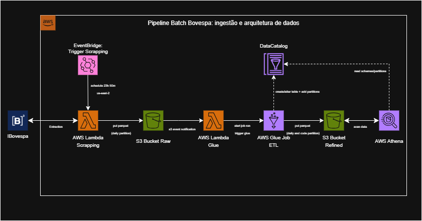

# Pipeline Batch Bovespa: ingestão e arquitetura de dados  - FIAP Machine Learning Tech Challenge 2

Projeto para construção de uma pipeline de dados completo para extrair, processar e analisar dados de ações ou 
índices da B3

|        |
|:-------------------------------------------------------------------------------------------------------------------------------------------------------------------------------------------------------------------------------------------------------------------------------------------------------------------------------------------------------------------------------------------------------------------------------------------------------------------------------------------------------------------------------------------------------------------------------------------------------------------------------------------------------------------------------------------:|

-----------------------------------

## Sumário

- [Descrição](#descrição)
- [Tecnologias Utilizadas](#tecnologias-utilizadas)
- [Arquitetura da Pipeline](#arquitetura-da-pipeline)
- [Como Utilizar](#como-utilizar)
- [Licença e Autores](#licença-e-autores)

-----------------------------------

## Descrição

O objetivo deste projeto é construir uma pipeline de dados batch para extrair, processar e analisar cotações diárias de ações ou índices da B3.
A ingestão é feita via scraping (ou fetch de uma fonte CSV/Parquet já consolidada), 
os dados brutos são armazenados no Amazon S3 em Parquet com partição diária, 
um S3 Event Notification aciona uma AWS Lambda que inicia um job do AWS Glue. 
O Glue executa as transformações obrigatórias e escreve os dados refinados (particionados por data e código da ação) de volta no S3. 
Por fim, os dados ficam catalogados automaticamente no Glue Data Catalog e são consultáveis via SQL no Amazon Athena.

-----------------------------------

## Tecnologias Utilizadas

### Tecnologias (Scripts / Código)

- **Python 3.11**
- **pandas**
- **pyarrow**
- **boto3**
- **requests**
- **PySpark**

### Tecnologias (AWS)

- **Amazon S3**
- **AWS Lambda**
- **AWS Glue**
- **Glue Data Catalog**
- **Amazon Athena**
- **Amazon EventBridge**
- **Amazon CloudWatch Logs**
- **AWS IAM**

-----------------------------------

## Arquitetura da Pipeline

A ingestão grava dados diários da B3 em S3/raw (Parquet, particionado por data). 
Um evento do S3 aciona a Lambda, que inicia o AWS Glue para 
transformar os dados (agregações, renomeações e métricas temporais) e 
salvar em S3/refined (partições por data e ticker), atualizando o Glue Data Catalog. 
As consultas são feitas no Amazon Athena, 
que usa o Catálogo para resolver o esquema e lê os arquivos diretamente do S3.



### 📂 Estrutura do Repositório

```
fiap-machine-learning-tech-challenge-2/
├── etl/                         
│   └── etl.py                   # Script para realizar ETL
├──lambda/
│   ├── lambda_scrapper.py       # Script contendo a lambda handler para realizar o scrapper
│   └── lambda_start_glue.py     # Script contendo a lambda handler para iniciar o glue
├── sanitize/                         
│   └── sanitize.py              # Limpeza básica e padronização de colunas num DataFrame pandas
├── scrapper/                         
│   └── ibov_to_s3.py            # Manipulações para o s3
└── requirements.txt             # Dependências gerais do projeto
```

## Como Utilizar

O seguinte script gera o zip da Lambda do scrapper

```powershell
$ErrorActionPreference = 'Stop'

# (a) Limpar e preparar pasta de build
Remove-Item -Recurse -Force build -ErrorAction Ignore
New-Item -ItemType Directory -Path build | Out-Null

# (b) Criar venv para evitar o erro de --user e usar o pip correto
py -m venv .venv
.\.venv\Scripts\Activate.ps1

# (c) Instalar SOMENTE o que precisa dentro de build/
python -m pip install --upgrade pip
python -m pip install --no-cache-dir --target build requests==2.32.3

# (d) Copiar seu código para build/
Copy-Item sanitize -Destination build\sanitize -Recurse
Copy-Item scrapper -Destination build\scrapper -Recurse
# (opcional) se precisar dessa pasta:
# Copy-Item outra_pasta -Destination build\outra_pasta -Recurse

# (e) Limpar lixos (opcional, só para reduzir tamanho)
Get-ChildItem build -Recurse -Include "__pycache__", "*.pyc", "tests" | Remove-Item -Recurse -Force

# (f) Gerar o ZIP  -> ZIP **do conteúdo** da pasta build (não zipar a pasta build em si!)
Compress-Archive -Path build\* -DestinationPath function.zip -Force

# (g) Desativar o venv
deactivate
```

-----------------------------------

## Licença e Autores

### 🧑‍💻 Desenvolvido por

- `Beatriz Rosa Carneiro Gomes - RM365967`
- `Cristine Scheibler - RM365433`
- `Guilherme Fernandes Dellatin - RM365508`
- `Iana Alexandre Neri - RM360484`
- `João Lucas Oliveira Hilario - RM366185`

Este projeto é apenas para fins educacionais e segue a licença MIT.